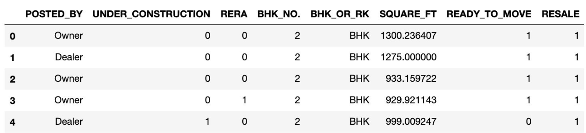
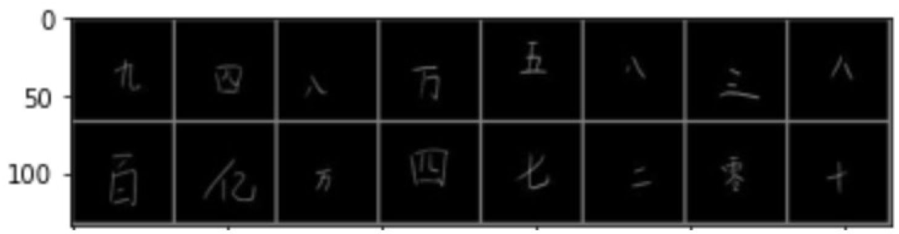

# Machine learning and deep learning project for ECE 196
More detailed information can be found in the ***"ML/DL Project Report"*** pdf file.

# Contributors
| Main Author  | Assistant |
| ------------- | ------------- |
| Benny Cai  | Stella Zhang  |

 

## Project 1: Indian house price prediction (ML)
Notebook can be found in the ***"Indian house prices ML.ipynb"*** file.

- **Brief Introduction**: This project aims to explore and analyze the data of a set of features/factors relevant to Indian house price, find the relationships between these features and the house price, and build a machine learning model that is able to predict the approximate house prices in India given that set of features.

- **Problem Solving Approach**: exploratory data analysis (EDA), feature extraction, one-hot encoding, standard scaler
- **Model selection**: Random Forest Regressor, DecisionTree Regressor
- **Model's Accracy Score**: 90%

 

## Project 2: Chinese MNIST Classification (ML/DL)
All three notebooks can be found in the ***"Chinese_mnist_project"*** folder.
 
- **Brief Introduction**: In this project, we were going to build both ML and DL models that are able to recognize the images of fifteen Chinese number characters, from 0 to 9 plus the characters for ten, hundred, thousand, 10 thousand and 100 million, and accurately predict the numerical values of these images.

 

### ML Model

- **Problem Solving Approach**: Unlike the built-in classic MNIST dataset, where images have already been converted to 28*28 pixels data and flattened to a 784-dimension array, we needed to find a way to manually read in the 64*64 pixels of our images and flatten them into a 4096-dimension array in order to process the data of our images. Then, we would use ***PCA*** to reduce the dimension of our array, because 4096 is quite a large number which may slow down the computation. Lastly, we applied the ***KNN classifier*** on our dataset.

- **Model selection**: K Nearest Neighbor Classifier

- **Model's Accracy Score**: 73.7% 

 

### DL Models

- **Problem Solving Approach**: We built DL models using two different approaches with different imported packages ––– one with tensorflow.keras, the other with pytorch.
For both approaches, we constructed and implemented a neural network, and applied the network to train our data to build the model. Ideally, the model we built with ***pytorch*** should perform better because we’ve applied a stronger neural network called ***“convolutional neural network (CNN)”*** algorithm to that model, which technically has a more complex and well-formed network structure.

- **MLP Network with tensorflow.keras Accuracy Score**: 87.5%
- **Convolutional neural network with pytorch Accuracy Score**: 90% 
